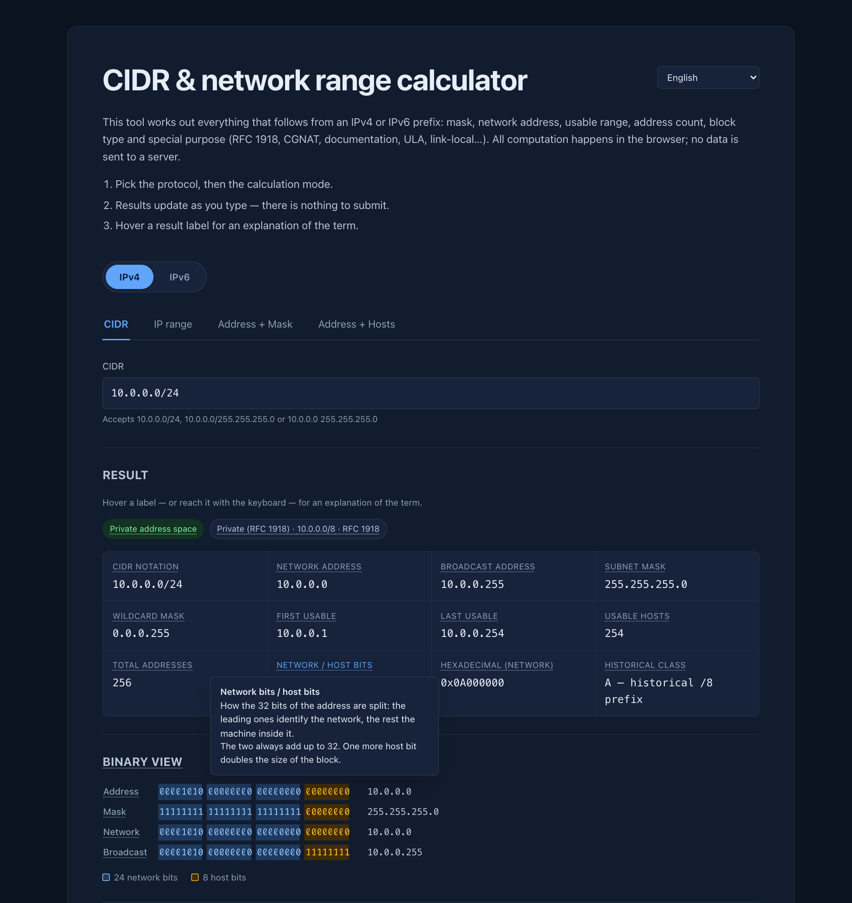

# CIDR Subnet Calculator — IPv4 & IPv6

A CIDR and subnet calculator that runs entirely in your browser. Netmask, network and
broadcast addresses, usable range, host count, VLSM subnetting, IP range → CIDR blocks,
RFC 5952 canonical IPv6, a binary bit view, and JSON/CSV export — with a hover glossary
that defines every term it shows you.

**[→ Open the calculator](https://maax6.github.io/cidr-subnet-calculator/)**

[](https://github.com/maax6/cidr-subnet-calculator/actions/workflows/deploy.yml)
[](LICENSE)

No backend, no tracking, no network calls at runtime. Available in **English, French,
Spanish, German, Portuguese and Simplified Chinese**.



## Why this one

Most subnet calculators give you the numbers. This one also tells you **what each number
means** — hover any result label and a tooltip explains the term, with a worked example
and the RFC that defines it. 48 terms, in all six languages.

It also handles the cases that quietly break other calculators:

| Case | What happens here |
|---|---|
| `10.0.0.0/31` | 2 usable addresses, no broadcast (RFC 3021) |
| `2001:db8::/127` | 2 usable addresses, point-to-point (RFC 6164) |
| `0.0.0.0/0` | 2³² addresses — no modulo-32 shift bug |
| `010.0.0.1` | **Rejected.** Leading zeros read as octal in some parsers — a classic SSRF filter bypass |
| `255.0.255.0` | **Rejected.** Non-contiguous mask |
| `1:2:3:4:5:6:7::8` | **Rejected.** `::` replaces no zero group |
| `fe80::1%eth0` | **Rejected**, with an explanation: a zone ID means nothing off the machine that wrote it |
| `2001:db8:0:0:1:0:0:1` | Compresses to `2001:db8::1:0:0:1` — longest zero run wins, leftmost on a tie |

## Features

A protocol switch picks IPv4 or IPv6; each has its own calculation modes.

### IPv4 — four modes

| Mode | Input | Output |
|---|---|---|
| **CIDR** | `10.0.0.0/24`, `10.0.0.0/255.255.255.0`, `10.0.0.0 255.255.255.0` | full block analysis |
| **IP range** | start + end | minimal CIDR decomposition, enclosing block, overshoot |
| **Address + Mask** | address + mask (`255.255.240.0` or `20`) | full block analysis |
| **Address + Hosts** | address + hosts required | smallest sufficient prefix |

Per block: netmask, wildcard mask, network address, broadcast, first/last usable address,
usable hosts, total addresses, hexadecimal, historical class, and special purpose
(RFC 1918, RFC 6598 CGNAT, RFC 3927 link-local, RFC 5737 documentation, multicast,
reserved…).

### IPv6 — three modes

| Mode | Input | Output |
|---|---|---|
| **CIDR** | `2001:db8:1:2::/64`, `2001:db8:: 32`, bare address (`/128`) | full block analysis |
| **IP range** | start + end | minimal CIDR decomposition, enclosing block, overshoot |
| **Address + Prefix** | address + length (0 to 128) | full block analysis |

Per block: compressed (RFC 5952) and expanded form, network address, last address,
first/last assignable, total and assignable addresses, interface identifier, 128-bit
hexadecimal, Subnet-Router anycast (RFC 4291), solicited-node multicast (RFC 4861),
multicast scope, MAC derived from a modified EUI-64 identifier, and block type (global
unicast, ULA, link-local, multicast, documentation, NAT64, Teredo, 6to4, IPv4-mapped…).

### Both

Binary view splitting network bits from host bits (32 or 128), subnetting with a table,
JSON/CSV export, clipboard copy, light and dark themes.

The glossary tooltip opens on hover **and** on keyboard focus, and closes on pointer
leave, blur, Escape and scroll. It renders into a portal on `document.body`: the result
containers carry `overflow: hidden` or `auto` and would clip an element positioned
inside them.

## Internationalisation

The calculation engines are pure and locale-free. They report *what* happened as a code,
and the interface picks the language at render time.

- Errors carry a `code` and `params` (`src/lib/errors.ts`) instead of a message.
- Notes expose a `noteKey`, special-purpose blocks a `labelKey`, multicast scopes a
  `ScopeKey`, historical classes a `noteKey`.
- `formatCount` and `formatBigCount` take the locale — `65 536` in French, `65,536` in
  English, `≈ 1,84 × 10^19` vs `≈ 1.84 × 10^19`.

Every dictionary in `Translation` is a `Record` closed over a union of keys, so adding a
term without translating it into all six languages breaks the build. Under a
`Record<string, …>` the missing entry would compile and simply render nothing — `Term`
would fall back to its children, and the omission would go unnoticed.

Three tests per locale cover what the type system cannot see: no empty strings, the
`{token}` placeholders preserved from the reference locale, and the example addresses
identical across languages — a "translated" address would be a typo no review catches.

Language choice persists in `localStorage`; a first visit follows `navigator.languages`,
falling back to English. The document `lang` attribute tracks the active locale.

## Development

```bash
npm install
npm run dev      # dev server
npm test         # Vitest on the pure logic and the locales (122 tests)
npm run build    # -> dist/
npm run preview
```

## Deployment

Pushing to `main` builds and publishes to GitHub Pages via
[`.github/workflows/deploy.yml`](.github/workflows/deploy.yml). Type-checking and the
full test suite gate the deploy, so nothing broken reaches the published page.

`vite.config.ts` sets `base: './'`, so `dist/` also drops straight into a domain root
**or** a subpath (`/tools/cidr/`) with no reconfiguration.

## Project structure

```
src/
  lib/ipv4.ts        IPv4 engine (pure, no DOM) — 32-bit integers
  lib/ipv6.ts        IPv6 engine (pure, no DOM) — 128-bit BigInt
  lib/errors.ts      code-carrying errors, shared by both engines
  lib/export.ts      JSON/CSV serialisation + download
  i18n/types.ts      Translation contract + the term-id union
  i18n/{fr,en,es,de,pt,zh}.ts    the six dictionaries
  i18n/index.tsx     detection, persistence, React context
  components/        Term (tooltip), ResultGrid, DataTable, BinaryView,
                     Field, LanguageSwitcher
  views/Ipv4Panel    IPv4 tabs, forms and results
  views/Ipv6Panel    IPv6 tabs, forms and results
  App.tsx            protocol switch
  styles.css         light + dark themes (prefers-color-scheme)
```

Three design decisions worth knowing before you edit:

**The glossary is keyed by identifier, never by label.** "Broadcast" appears in the
result grid, in the binary view and in a table header for one definition; one label can
cover two concepts depending on the prefix ("Broadcast address" becomes "Last address in
block" at /31 and /32, which have none); and the label changes with the language while
the identifier holds still.

**The two engines stay separate.** The field sets genuinely differ — IPv6 has no
broadcast, no wildcard mask, no historical class — and BigInt would infect every IPv4
function while adding nothing to 32-bit integers.

**All six dictionaries ship in the bundle** rather than loading on demand. The glossary
*is* the product here, and a language switch that blanked the page for a moment would
cost more than the kilobytes saved.

## Stack

Vite 6 · React 19 · TypeScript 5.7 · Vitest 3. No runtime dependencies beyond React.

## License

MIT — see [LICENSE](LICENSE).
